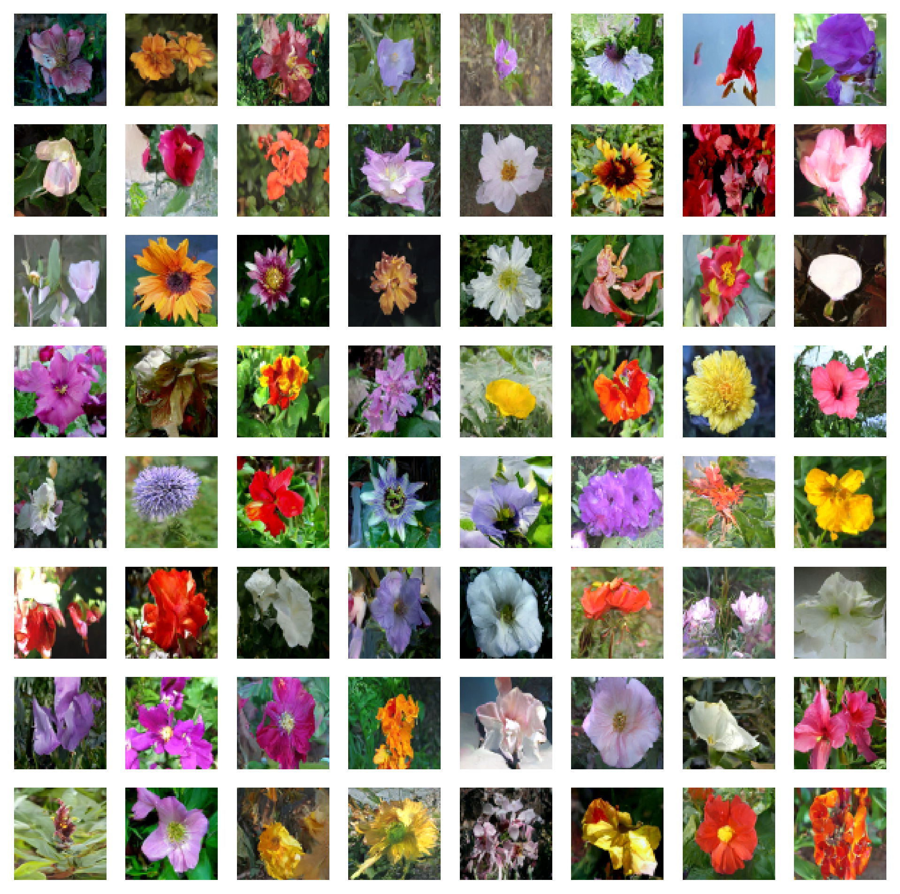

# 

**This project is partially supported by [Google TPU Research Cloud](https://sites.research.google/trc/about/). I would like to thank the Google Cloud TPU team for providing me with the resources to train the bigger text-conditional models in multi-host distributed settings.**

## A Versatile and simple Diffusion Library

In recent years, diffusion and score-based multi-step models have revolutionized the generative AI domain. However, the latest research in this field has become highly math-intensive, making it challenging to understand how state-of-the-art diffusion models work and generate such impressive images. Replicating this research in code can be daunting.

FlaxDiff is a library of tools (schedulers, samplers, models, etc.) designed and implemented in an easy-to-understand way. The focus is on understandability and readability over performance. I started this project as a hobby to familiarize myself with Flax and Jax and to learn about diffusion and the latest research in generative AI.

I initially started this project in Keras, being familiar with TensorFlow 2.0, but transitioned to Flax, powered by Jax, for its performance and ease of use. The old notebooks and models, including my first Flax models, are also provided.

The `Diffusion_flax_linen.ipynb` notebook is my main workspace for experiments. Several checkpoints are uploaded to the `pretrained` folder along with a copy of the working notebook associated with each checkpoint. *You may need to copy the notebook to the working root for it to function properly.*

## Example Notebooks from scratch

In the `example notebooks` folder, you will find comprehensive notebooks for various diffusion techniques, written entirely from scratch and are independent of the FlaxDiff library. Each notebook includes detailed explanations of the underlying mathematics and concepts, making them invaluable resources for learning and understanding diffusion models.

### Available Notebooks and Resources

- **[Diffusion explained (nbviewer link)](https://nbviewer.org/github/AshishKumar4/FlaxDiff/blob/main/tutorial%20notebooks/simple%20diffusion%20flax.ipynb) [(local link)](tutorial%20notebooks/simple%20diffusion%20flax.ipynb)** 

  - **WORK IN PROGRESS** An in-depth exploration of the concept of Diffusion based generative models, DDPM (Denoising Diffusion Probabilistic Models), DDIM (Denoising Diffusion Implicit Models), and the SDE/ODE generalizations of diffusion, with step-by-step explainations and code.
  
  <a target="_blank" href="https://colab.research.google.com/github/AshishKumar4/FlaxDiff/blob/main/tutorial%20notebooks/simple%20diffusion%20flax.ipynb">
  
</a>

- **[EDM (Elucidating the Design Space of Diffusion-based Generative Models)](tutorial%20notebooks/edm%20tutorial.ipynb)**
  - **TODO** A thorough guide to EDM, discussing the innovative approaches and techniques used in this advanced diffusion model.
  
  <a target="_blank" href="https://colab.research.google.com/github/AshishKumar4/FlaxDiff/blob/main/tutorial%20notebooks/edm%20tutorial.ipynb">
  
</a>

These notebooks aim to provide a very easy to understand and step-by-step guide to the various diffusion models and techniques. They are designed to be beginner-friendly, and thus although they may not adhere to the exact formulations and implementations of the original papers to make them more understandable and generalizable, I have tried my best to keep them as accurate as possible. If you find any mistakes or have any suggestions, please feel free to open an issue or a pull request.

#### Other resources

- **[Multi-host Data parallel training script in JAX](./training.py)**
  - Training script for multi-host data parallel training in JAX, to serve as a reference for training large models on multiple GPUs/TPUs across multiple hosts. A full-fledged tutorial notebook is in the works.

- **[TPU utilities for making life easier](./tpu-tools/)**
  - A collection of utilities and scripts to make working with TPUs easier, such as cli to create/start/stop/setup TPUs, script to setup TPU VMs (install everything you need), mounting gcs datasets etc.

## Disclaimer (and About Me)

I worked as a Machine Learning Researcher at Hyperverge from 2019-2021, focusing on computer vision, specifically facial anti-spoofing and facial detection & recognition. Since switching to my current job in 2021, I haven't engaged in as much R&D work, leading me to start this pet project to revisit and relearn the fundamentals and get familiar with the state-of-the-art. My current role involves primarily Golang system engineering with some applied ML work just sprinkled in. Therefore, the code may reflect my learning journey. Please forgive any mistakes and do open an issue to let me know.

Also, few of the text may be generated with help of github copilot, so please excuse any mistakes in the text.

## Index

- [A Versatile and Easy-to-Understand Diffusion Library](#a-versatile-and-easy-to-understand-diffusion-library)
- [Disclaimer (and About Me)](#disclaimer-and-about-me)
- [Features](#features)
  - [Schedulers](#schedulers)
  - [Model Predictors](#model-predictors)
  - [Samplers](#samplers)
  - [Training](#training)
  - [Models](#models)
- [Installation of FlaxDiff](#installation)
- [Getting Started with FlaxDiff](#getting-started)
  - [Training Example](#training-example)
  - [Inference Example](#inference-example)
- [References and Acknowledgements](#references-and-acknowledgements)
- [Pending things to do list](#pending-things-to-do-list)
- [Gallery](#gallery)
- [Contribution](#contribution)
- [License](#license)

## Features

### Schedulers
Implemented in `flaxdiff.schedulers`:
- **LinearNoiseSchedule** (`flaxdiff.schedulers.LinearNoiseSchedule`): A beta-parameterized discrete scheduler.
- **CosineNoiseSchedule** (`flaxdiff.schedulers.CosineNoiseSchedule`): A beta-parameterized discrete scheduler.
- **ExpNoiseSchedule** (`flaxdiff.schedulers.ExpNoiseSchedule`): A beta-parameterized discrete scheduler.
- **CosineContinuousNoiseScheduler** (`flaxdiff.schedulers.CosineContinuousNoiseScheduler`): A continuous scheduler.
- **CosineGeneralNoiseScheduler** (`flaxdiff.schedulers.CosineGeneralNoiseScheduler`): A continuous sigma parameterized cosine scheduler.
- **KarrasVENoiseScheduler** (`flaxdiff.schedulers.KarrasVENoiseScheduler`): A sigma-parameterized continuous scheduler proposed by Karras et al. 2022, best suited for inference.
- **EDMNoiseScheduler** (`flaxdiff.schedulers.EDMNoiseScheduler`): A sigma-parameterized continuous scheduler based on the Exponential Diffusion Model (EDM), best suited for training with the KarrasKarrasVENoiseScheduler.

### Model Predictors
Implemented in `flaxdiff.predictors`:
- **EpsilonPredictor** (`flaxdiff.predictors.EpsilonPredictor`): Predicts the noise in the data.
- **X0Predictor** (`flaxdiff.predictors.X0Predictor`): Predicts the original data from the noisy data.
- **VPredictor** (`flaxdiff.predictors.VPredictor`): Predicts a linear combination of the data and noise, commonly used in the EDM.
- **KarrasEDMPredictor** (`flaxdiff.predictors.KarrasEDMPredictor`): A generalized predictor for the EDM, integrating various parameterizations.

### Samplers
Implemented in `flaxdiff.samplers`:
- **DDPMSampler** (`flaxdiff.samplers.DDPMSampler`): Implements the Denoising Diffusion Probabilistic Model (DDPM) sampling process.
- **DDIMSampler** (`flaxdiff.samplers.DDIMSampler`): Implements the Denoising Diffusion Implicit Model (DDIM) sampling process.
- **EulerSampler** (`flaxdiff.samplers.EulerSampler`): An ODE solver sampler using Euler's method.
- **HeunSampler** (`flaxdiff.samplers.HeunSampler`): An ODE solver sampler using Heun's method.
- **RK4Sampler** (`flaxdiff.samplers.RK4Sampler`): An ODE solver sampler using the Runge-Kutta method.
- **MultiStepDPM** (`flaxdiff.samplers.MultiStepDPM`): Implements a multi-step sampling method inspired by the Multistep DPM solver as presented here: [tonyduan/diffusion](https://github.com/tonyduan/diffusion/blob/fcc0ed829baf29e1493b460b073e735a848c08ea/src/samplers.py#L44)) 

### Training
Implemented in `flaxdiff.trainer`:
- **DiffusionTrainer** (`flaxdiff.trainer.DiffusionTrainer`): A class designed to facilitate the training of diffusion models. It manages the training loop, loss calculation, and model updates.

### Models
Implemented in `flaxdiff.models`:
- **UNet** (`flaxdiff.models.simple_unet.SimpleUNet`): A sample UNET architecture for diffusion models.
- **Layers**: A library of layers including upsampling (`flaxdiff.models.simple_unet.Upsample`), downsampling (`flaxdiff.models.simple_unet.Downsample`), Time embeddings (`flaxdiff.models.simple_unet.FouriedEmbedding`), attention (`flaxdiff.models.simple_unet.AttentionBlock`), and residual blocks (`flaxdiff.models.simple_unet.ResidualBlock`).

## Installation

To install FlaxDiff, you need to have Python 3.10 or higher. Install the required dependencies using:

```bash
pip install -r requirements.txt
```

The models were trained and tested with jax==0.4.28 and flax==0.8.4. However, when I updated to the latest jax==0.4.30 and flax==0.8.5, 
the models stopped training. There seems to have been some major change breaking the training dynamics and therefore I would recommend
sticking to the versions mentioned in the requirements.txt

## Getting Started

### Training Example

Here is a simplified example to get you started with training a diffusion model using FlaxDiff:

```python
from flaxdiff.schedulers import EDMNoiseScheduler
from flaxdiff.predictors import KarrasPredictionTransform
from flaxdiff.models.simple_unet import SimpleUNet as UNet
from flaxdiff.trainer import DiffusionTrainer
import jax
import optax
from datetime import datetime

BATCH_SIZE = 16
IMAGE_SIZE = 64

# Define noise scheduler
edm_schedule = EDMNoiseScheduler(1, sigma_max=80, rho=7, sigma_data=0.5)

# Define model
unet = UNet(emb_features=256, 
            feature_depths=[64, 128, 256, 512],
            attention_configs=[{"heads":4}, {"heads":4}, {"heads":4}, {"heads":4}, {"heads":4}],
            num_res_blocks=2,
            num_middle_res_blocks=1)

# Load dataset
data, datalen = get_dataset("oxford_flowers102", batch_size=BATCH_SIZE, image_scale=IMAGE_SIZE)
batches = datalen // BATCH_SIZE

# Define optimizer
solver = optax.adam(2e-4)

# Create trainer
trainer = DiffusionTrainer(unet, optimizer=solver, 
                           noise_schedule=edm_schedule,
                           rngs=jax.random.PRNGKey(4), 
                           name="Diffusion_SDE_VE_" + datetime.now().strftime("%Y-%m-%d_%H:%M:%S"),
                           model_output_transform=KarrasPredictionTransform(sigma_data=edm_schedule.sigma_data))

# Train the model
final_state = trainer.fit(data, batches, epochs=2000)
```

### Inference Example

Here is a simplified example for generating images using a trained model:

```python
from flaxdiff.samplers import DiffusionSampler

class EulerSampler(DiffusionSampler):
    def take_next_step(self, current_samples, reconstructed_samples, pred_noise, current_step, state, next_step=None):
        current_alpha, current_sigma = self.noise_schedule.get_rates(current_step)
        next_alpha, next_sigma = self.noise_schedule.get_rates(next_step)
        dt = next_sigma - current_sigma
        x_0_coeff = (current_alpha * next_sigma - next_alpha * current_sigma) / dt
        dx = (current_samples - x_0_coeff * reconstructed_samples) / current_sigma
        next_samples = current_samples + dx * dt
        return next_samples, state

# Create sampler
sampler = EulerSampler(trainer.model, trainer.state.ema_params, edm_schedule, model_output_transform=trainer.model_output_transform)

# Generate images
samples = sampler.generate_images(num_images=64, diffusion_steps=100, start_step=1000, end_step=0)
plotImages(samples, dpi=300)
```

## References and Acknowledgements

### Research papers and preprints
- The Original Denoising Diffusion Probabilistic Models (DDPM) [paper](https://arxiv.org/abs/2006.11239)
- Denoising Diffusion Implicit Models (DDIM) [paper](https://arxiv.org/abs/2010.02502)
- Improved Denoising Diffusion Probabilistic Models [paper](https://arxiv.org/abs/2102.09672)
- Diffusion Models beat GANs on image synthesis [paper](https://arxiv.org/pdf/2105.05233)
- Score-Based Generative Modeling through Stochastic Differential Equations [paper](https://arxiv.org/pdf/2011.13456)
- Elucidating the design space of Diffusion-based generative models (EDM) [paper](https://arxiv.org/abs/2206.00364)
- Perception Prioritized Training of Diffusion Models (P2 Weighting) [paper](https://arxiv.org/abs/2204.00227)
- Pseudo Numerical Methods for Diffusion Models on Manifolds (PNMDM) [paper](https://arxiv.org/abs/2202.09778)
- The DPM-Solver:A Fast ODE Solver for Diffusion Probabilistic Model Sampling in Around 10 Steps [paper](https://arxiv.org/pdf/2206.00927)

### Useful blogs and codebases

- An incredible series of blogs on various diffusion related topics by [Sander Dieleman](https://sander.ai/posts/). The posts particularly on [diffusion models](https://sander.ai/2022/01/31/diffusion.html), [Typicality](https://sander.ai/2020/09/01/typicality.html), [Geometry of Diffusion Guidance](https://sander.ai/2023/08/28/geometry.html#warning) and [Noise Schedules](https://sander.ai/2024/06/14/noise-schedules.html) are a must read
- An awesome blog series by Tony Duan on [Diffusion models from scratch](https://www.tonyduan.com/diffusion/index.html). Although it trains models for MNIST and the implementations are a bit basic, the maths is explained in a very nice way. The codebase is [here](https://github.com/tonyduan/diffusion)
- The [k-diffusion](https://github.com/crowsonkb/k-diffusion/) codebase Katherine Crowson, which hosts an exhaustive implementation of the EDM paper (Karras et al) along with the DPM-Solver, DPM-Solver++ (both 2S and 2M) in pytorch. Most other diffusion libraries borrow from this.
- The [Official EDM implementation](https://github.com/NVlabs/edm) by Tero Karras, in pytorch. Really neat code and the reference implementation for all the karras based samplers/schedules.
- The [Hugging Face Diffusers Library](https://github.com/huggingface/diffusers), Arguably the most complete set of implementations for the latest state-of-the-art techniques and concepts in this field. Written mainly in pytorch, but with flax implementations also available for a lot of the concepts, the focus of this repository is on completeness and ease of understanding as well.
- The [Keras DDPM Tutorial](https://keras.io/examples/generative/ddpm/) by A_K Nain, and the [Keras DDIM implementation](https://keras.io/examples/generative/ddim/) by András Béres, which are great starting points for beginners to understand the basics of diffusion models. I started my journey by trying to implement the concepts introduced in these tutorials from scratch.
- Special thanks to ChatGPT-4 by OpenAI for helping clear my doubts.

## Pending things to do list

- **Advanced solvers like DPM/DPM2/DPM++ etc**
- **SDE versions of the current ODE solvers i.e, ancestral sampling**
- **Text Conditioned image generation**
- **Classifier and Classified Free Guidance**

## Gallery

### Images generated by Euler Ancestral Sampler in 200 Steps [text2image with CFG]
Model trained on Laion-Aesthetics 12M + CC12M + MS COCO + 1M aesthetic 6+ subset of COYO-700M on TPU-v4-32:
`a beautiful landscape with a river with mountains, a beautiful landscape with a river with mountains, a beautiful landscape with a river with mountains, a beautiful landscape with a river with mountains, a beautiful landscape with a river with mountains, a beautiful landscape with a river with mountains, a beautiful landscape with a river with mountains, a beautiful landscape with a river with mountains, a beautiful landscape with a river with mountains, a beautiful landscape with a river with mountains, a beautiful landscape with a river with mountains, a beautiful landscape with a river with mountains, a beautiful landscape with a river with mountains, a beautiful landscape with a river with mountains, a beautiful landscape with a river with mountains, a beautiful landscape with a river with mountains, a beautiful forest with a river and sunlight, a beautiful forest with a river and sunlight, a beautiful forest with a river and sunlight, a beautiful forest with a river and sunlight, a beautiful forest with a river and sunlight, a beautiful forest with a river and sunlight, a beautiful forest with a river and sunlight, a beautiful forest with a river and sunlight, a big mansion with a garden, a big mansion with a garden, a big mansion with a garden, a big mansion with a garden, a big mansion with a garden, a big mansion with a garden, a big mansion with a garden, a big mansion with a garden`

**Params**:
`Dataset: Laion-Aesthetics 12M + CC12M + MS COCO + 1M aesthetic 6+ subset of COYO-700M`
`Batch size: 256`
`Image Size: 128`
`Training Epochs: 5`
`Steps per epoch: 74573`
`Model Configurations: feature_depths=[128, 256, 512, 1024]`

`Training Noise Schedule: EDMNoiseScheduler`
`Inference Noise Schedule: KarrasEDMPredictor`


### Images generated by Euler Ancestral Sampler in 200 Steps [text2image with CFG]
Images generated by the following prompts using classifier free guidance with guidance factor = 2:
`'water tulip, a water lily, a water lily, a water lily, a photo of a marigold, a water lily, a water lily, a photo of a lotus, a photo of a lotus, a photo of a lotus, a photo of a rose, a photo of a rose, a photo of a rose, a photo of a rose, a photo of a rose'`

**Params**: 
`Dataset: oxford_flowers102`
`Batch size: 16`
`Image Size: 128`
`Training Epochs: 1000`
`Steps per epoch: 511`

`Training Noise Schedule: EDMNoiseScheduler`
`Inference Noise Schedule: KarrasEDMPredictor`


### Images generated by Euler Ancestral Sampler in 200 Steps [text2image with CFG]
Images generated by the following prompts using classifier free guidance with guidance factor = 4: 
`'water tulip, a water lily, a water lily, a photo of a rose, a photo of a rose, a water lily, a water lily, a photo of a marigold, a photo of a marigold, a photo of a marigold, a water lily, a photo of a sunflower, a photo of a lotus, columbine, columbine, an orchid, an orchid, an orchid, a water lily, a water lily, a water lily, columbine, columbine, a photo of a sunflower, a photo of a sunflower, a photo of a sunflower, a photo of a lotus, a photo of a lotus, a photo of a marigold, a photo of a marigold, a photo of a rose, a photo of a rose, a photo of a rose, orange dahlia, orange dahlia, a lenten rose, a lenten rose, a water lily, a water lily, a water lily, a water lily, an orchid, an orchid, an orchid, hard-leaved pocket orchid, bird of paradise, bird of paradise, a photo of a lovely rose, a photo of a lovely rose, a photo of a globe-flower, a photo of a globe-flower, a photo of a lovely rose, a photo of a lovely rose, a photo of a ruby-lipped cattleya, a photo of a ruby-lipped cattleya, a photo of a lovely rose, a water lily, a osteospermum, a osteospermum, a water lily, a water lily, a water lily, a red rose, a red rose'`

**Params**: 
`Dataset: oxford_flowers102`
`Batch size: 16`
`Image Size: 128`
`Training Epochs: 1000`
`Steps per epoch: 511`

`Training Noise Schedule: EDMNoiseScheduler`
`Inference Noise Schedule: KarrasEDMPredictor`


### Images generated by DDPM Sampler in 1000 steps [Unconditional]

**Params**: 
`Dataset: oxford_flowers102`
`Batch size: 16`
`Image Size: 64`
`Training Epochs: 1000`
`Steps per epoch: 511`

`Training Noise Schedule: CosineNoiseSchedule`
`Inference Noise Schedule: CosineNoiseSchedule`

`Model: UNet(emb_features=256, 
            feature_depths=[64, 128, 256, 512],
            attention_configs=[{"heads":4}, {"heads":4}, {"heads":4}, {"heads":4}, {"heads":4}],
            num_res_blocks=2,
            num_middle_res_blocks=1)`


### Images generated by DDPM Sampler in 1000 steps [Unconditional]

**Params**: 
`Dataset: oxford_flowers102`
`Batch size: 16`
`Image Size: 64`
`Training Epochs: 1000`
`Steps per epoch: 511`

`Training Noise Schedule: CosineNoiseSchedule`
`Inference Noise Schedule: CosineNoiseSchedule`

`Model: UNet(emb_features=256, 
            feature_depths=[64, 128, 256, 512],
            attention_configs=[{"heads":4}, {"heads":4}, {"heads":4}, {"heads":4}, {"heads":4}],
            num_res_blocks=2,
            num_middle_res_blocks=1)`


### Images generated by Heun Sampler in 10 steps (20 model inferences as Heun takes 2x inference steps) [Unconditional]

**Params**: 
`Dataset: oxford_flowers102`
`Batch size: 16`
`Image Size: 64`
`Training Epochs: 1000`
`Steps per epoch: 511`

`Training Noise Schedule: EDMNoiseScheduler`
`Inference Noise Schedule: KarrasEDMPredictor`

`Model: UNet(emb_features=256, 
            feature_depths=[64, 128, 256, 512],
            attention_configs=[{"heads":4}, {"heads":4}, {"heads":4}, {"heads":4}, {"heads":4}],
            num_res_blocks=2,
            num_middle_res_blocks=1)`




## Contribution

Feel free to contribute by opening issues or submitting pull requests. Let's make FlaxDiff better together!

## License

This project is licensed under the MIT License.
